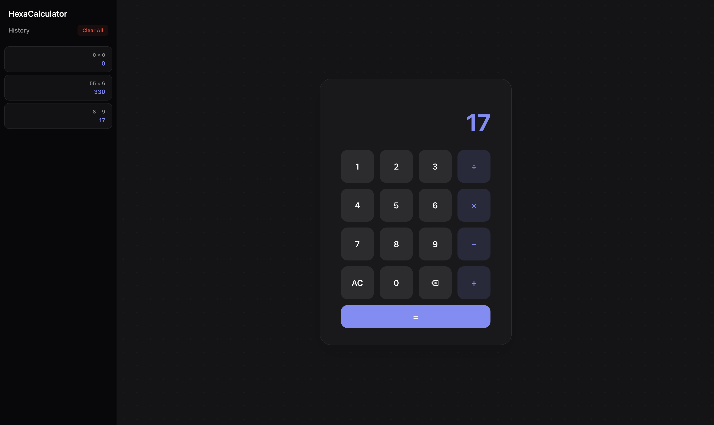

# HexaCalculator

View HexaCalculator at: https://hexa-programmer.github.io/HexaCalculator/



HexaCalculator is a minimal, web application built using HTML, CSS, and JavaScript.  
It runs entirely in the browser with no backend and uses localStorage to store calculation history.

---

## Features

    1) Basic Arithmetic: Perform addition, subtraction, multiplication, and division.

    2) Calculation History: Automatically saves completed calculations in a sidebar.

    3) Persistent Storage: Uses localStorage to keep calculation history after refresh.

    4) Responsive Design: Optimized for both desktop and mobile devices.

    5) Beautiful UI: Modern glassmorphism-inspired interface with automatic light and dark mode support.

---

## How it works

Each completed calculation is stored as an object:
```
    {
        expr: "12 + 5",
        res: 17
    }
```
All calculations are stored in browser storage using:
```
    localStorage
```
This allows calculation history to persist without any backend.

---

## Tech Stack

    - HTML5
    - CSS3
    - Vanilla JavaScript (no frameworks)

---

## Installation

To run HexaCalculator locally:
```
    git clone https://github.com/Hexa-Programmer/HexaCalculator.git
    cd HexaCalculator
    open index.html
```
---

## Note

This is a personal learning project and will continue to evolve over time.

---

Made with ❤️ by Hexa-Programmer